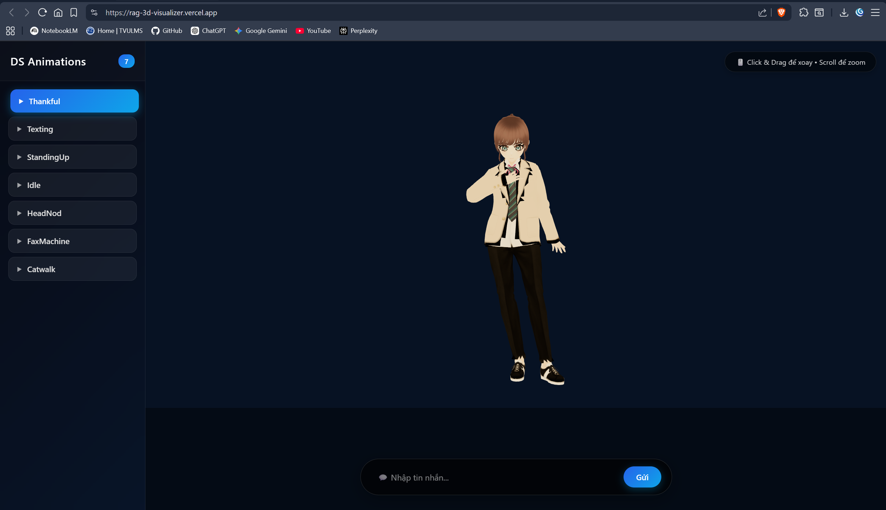

# 🎨 3D Character Viewer with Animations

> Ứng dụng xem nhân vật 3D tương tác cao cấp với animations realtime, kết hợp **RAG AI Chatbot** + **Text-to-Speech**

**🔗 [Live Demo](https://rag-3d-visualizer.vercel.app/)** | **💻 [GitHub](https://github.com/thhieu2904/rag-3d-visualizer)**

---

## 📸 Demo



Nhân vật 3D tương tác với 7+ animations, hỗ trợ chatbot AI tích hợp RAG cho phản hồi tự động.

---

## ✨ Tính năng

- ✅ **Nhân vật 3D Realtime** — Render đầy đủ materials, textures, lighting
- ✅ **7+ Animations** — Idle, walking, greeting, texting, v.v.
- ✅ **Interactive Controls** — Click & drag để xoay, scroll để zoom, click animation
- ✅ **Chat Integration** — Chatbot AI (RAG), avatar phản ứng theo cảm xúc
- ✅ **Text-to-Speech** — Đọc câu trả lời giọng nói tiếng Việt
- ✅ **Fully Customizable** — Thêm animations mới, thay model dễ dàng

---

## 🚀 Chạy nhanh

```bash
# 1. Cài đặt dependencies
npm install

# 2. Dev server
npm run dev

# 3. Mở trình duyệt
open http://localhost:5173
```

### Điều khiển

| Thao tác | Chức năng |
|---------|----------|
| 🖱️ **Click & Drag** | Xoay nhân vật |
| 🔄 **Scroll** | Zoom in/out |
| 🎬 **Sidebar** | Chọn animation |
| 💬 **Chat Input** | Nhắn tin chatbot |

---

## 🛠️ Tech Stack

| Lớp | Công nghệ |
|------|-----------|
| 🎨 **Frontend** | React 19 + TypeScript + Vite 7 |
| 🎬 **3D Rendering** | Three.js + @react-three/fiber |
| 🎯 **3D Helpers** | @react-three/drei (OrbitControls, GLTF, Animations) |
| 📦 **Pipeline** | VRoid Studio → Blender 4.2 → Mixamo → GLB |
| 🤖 **RAG (Optional)** | FastAPI / LangChain + Chroma Vector DB |
| 🔊 **TTS (Optional)** | Web Speech API (browser native) |

---

## 📁 Cấu trúc thư mục

```
3D_Blender/
│
├── 📄 src/                              # React source
│   ├── App.tsx                          # Main component
│   ├── App.css                          # Styling
│   ├── main.tsx                         # Entry point
│   └── index.css                        # Global styles
│
├── 📦 public/models/
│   └── character.glb                    # Final 3D model
│
├── 🔧 scripts/                          # Blender automation
│   ├── convert_to_glb.py                # Merge FBX + animations
│   ├── fix_materials_from_vrm.py        # Restore materials
│   └── README.md                        # Script docs
│
├── 📂 assets/pipeline/                  # Raw assets
│   ├── AIC_Female_v1.vrm                # VRoid model
│   ├── upload_Mixamo.fbx                # Base FBX
│   ├── file_new.fbx                     # Mixamo skeleton
│   └── *.fbx                            # Animation FBXs
│
├── 📚 ThamKhao/                         # References
├── vite.config.ts
├── tsconfig.json
├── package.json
└── README.md
```

---

## 🎬 3D Pipeline

Quy trình 6 bước: Design → Web

```
┌──────────────┐
│ VRoid Studio │  → Tạo nhân vật, export VRM
└───────┬──────┘
        ▼
┌──────────────┐
│  Blender     │  → Import VRM, export T-pose FBX
└───────┬──────┘
        ▼
┌──────────────┐
│   Mixamo     │  → Auto-rig, download 7 animations
└───────┬──────┘
        ▼
┌──────────────────────────────────────┐
│ convert_to_glb.py (Step 1)           │  → Merge base + animations
│ → character.glb (no materials yet)   │
└────────────┬─────────────────────────┘
             ▼
┌──────────────────────────────────────┐
│ fix_materials_from_vrm.py (Step 2)   │  → Restore materials from VRM
│ → character.glb (complete!)          │
└────────────┬─────────────────────────┘
             ▼
┌──────────────┐
│  React App   │  → Load GLB + Play animations
└──────────────┘
```

**Tại sao phức tạp?** VRM dùng MToon shader (không tương thích Mixamo) → phải tách workflow.

---

## 🔧 Blender Scripts

### 1️⃣ `convert_to_glb.py` — Merge Animations

Chạy khi thêm animation hoặc rebuild model:

```bash
blender --background --python scripts/convert_to_glb.py
```

**Thêm animation mới:**
1. Download FBX từ [Mixamo](https://mixamo.com) (**Without Skin**)
2. Lưu vào `assets/pipeline/MyAnimation.fbx`
3. Chỉnh `ANIMATIONS` dict trong `convert_to_glb.py`:
   ```python
   ANIMATIONS = {
       "Catwalk Walk Stop Twist R.fbx": "Catwalk",
       "MyAnimation.fbx": "MyAnimation",  # ← Add this
   }
   ```
4. Chạy lại script

### 2️⃣ `fix_materials_from_vrm.py` — Restore Materials

Chạy **sau** `convert_to_glb.py`:

```bash
blender --background --python scripts/fix_materials_from_vrm.py
```

📌 **Luôn chạy theo thứ tự:** Step 1 → Step 2

---

## 🎬 Available Animations

| Icon | Name | Description |
|------|------|-------------|
| 🚶 | **Catwalk** | Walking with turns |
| 📠 | **FaxMachine** | Using machine |
| 🧠 | **HeadNod** | Nodding (thinking/confirm) |
| 🧍 | **Idle** | Standing idle |
| ⬆️ | **StandingUp** | Getting up from chair |
| 📱 | **Texting** | Typing phone |
| 🙏 | **Thankful** | Thanking/Greeting |

---

## ➕ Thêm Animation Mới (5 bước)

1. **Mixamo** → [mixamo.com](https://mixamo.com) → Tải FBX (Without Skin)
2. **Save** → `assets/pipeline/MyNewAnim.fbx`
3. **Edit** → `scripts/convert_to_glb.py` → Thêm vào `ANIMATIONS` dict
4. **Run Scripts:**
   ```bash
   blender --background --python scripts/convert_to_glb.py
   blender --background --python scripts/fix_materials_from_vrm.py
   ```
5. **Reload** browser → Animation xuất hiện sidebar! ✨

---

## 🤖 RAG Chatbot + Avatar Reactions

### 1️⃣ Emotion → Animation Map

Create `src/animationMap.ts`:

```typescript
export const EMOTION_TO_ANIMATION: Record<string, string> = {
  greeting:   "Thankful",       // chào, cảm ơn
  thinking:   "HeadNod",        // xử lý, xác nhận
  explaining: "FaxMachine",     // trình bày
  walking:    "Catwalk",        // di chuyển
  idle:       "Idle",           // chờ
  texting:    "Texting",        // loading
};

export function getAnimation(emotion: string): string {
  return EMOTION_TO_ANIMATION[emotion] ?? "Idle";
}
```

### 2️⃣ Backend Setup (FastAPI)

```python
from fastapi import FastAPI
from pydantic import BaseModel

app = FastAPI()

class ChatRequest(BaseModel):
    message: str

@app.post("/api/chat")
async def chat(req: ChatRequest):
    # Gọi RAG chain
    answer = rag_chain.invoke(req.message)
    
    # Rule-based emotion detection
    emotion = "idle"
    if any(w in req.message for w in ["cảm ơn", "thank", "xin chào"]):
        emotion = "greeting"
    elif any(w in answer for w in ["vì vậy", "do đó"]):
        emotion = "explaining"
    elif "?" in req.message:
        emotion = "thinking"
    
    return {"answer": answer, "emotion": emotion}
```

### 3️⃣ Frontend Connection (App.tsx)

```typescript
import { getAnimation } from './animationMap';

const handleSend = async (message: string) => {
  setAction("Texting");  // Loading animation
  
  try {
    const res = await fetch("/api/chat", {
      method: "POST",
      headers: { "Content-Type": "application/json" },
      body: JSON.stringify({ message }),
    });
    
    const { answer, emotion } = await res.json();
    setAction(getAnimation(emotion));  // Avatar reacts!
    
    // Optional: Text-to-speech
    if ('speechSynthesis' in window) {
      speak(answer);
    }
  } catch (error) {
    console.error(error);
    setAction("Idle");
  }
};

function speak(text: string) {
  const utterance = new SpeechSynthesisUtterance(text);
  utterance.lang = "vi-VN";
  utterance.onend = () => setAction("Idle");
  window.speechSynthesis.speak(utterance);
}
```

**Result:** User chats → Avatar reacts + speaks automatically 🎬

---

## 🎯 Future Features

| Feature | Difficulty | Notes |
|---------|-----------|-------|
| 💬 **Full RAG Chatbot** | ⭐⭐⭐ | Backend + vector DB |
| 🎬 **Lip Sync** | ⭐⭐⭐⭐ | Blend shapes + visemes |
| 😊 **Facial Expressions** | ⭐⭐ | VRM BlendShapes |
| 👥 **Multi-Character** | ⭐⭐ | Switch models via UI |
| 🏠 **3D Environment** | ⭐⭐⭐ | HDRI background |
| 🎵 **Background Music** | ⭐ | Pause during speech |
| 📊 **Streaming** | ⭐⭐ | SSE/WebSocket |

---

## 📋 Requirements

- **Node.js** 18+
- **Blender 4.2+** (chỉ nếu thêm animations)
- **Python 3.8+** (Blender scripts)
- **Backend** (FastAPI/Express) — nếu thêm RAG

---

## 🚀 Build & Deploy

### Development

```bash
npm install
npm run dev
# http://localhost:5173
```

### Production

```bash
npm run build
npm run preview  # Test locally
```

### Vercel Deployment

```bash
git push origin main
# Connect on Vercel dashboard: https://vercel.com/new
# Auto-deploys on each push
```

---

## 🐛 Troubleshooting

| Issue | Solution |
|-------|----------|
| **White model** | Run `fix_materials_from_vrm.py` |
| **No animations** | Check action names, hard refresh |
| **Chat 404** | Backend must be running |
| **Lag/FPS** | Enable compression, reduce mesh complexity |
| **Blender error** | Update to 4.2+, check Python path |

---

## 📚 Resources

- 🎨 [VRoid Studio](https://vroid.com/)
- 🎬 [Mixamo](https://mixamo.com/)
- 📦 [three-vrm](https://github.com/pixiv/three-vrm)
- 🔗 [React Three Fiber](https://docs.pmndrs.com/react-three-fiber/)
- 🤖 [LangChain](https://js.langchain.com/)

---

## 🧠 Technical Notes

### Why VRM → FBX → Mixamo → GLB?

**Problem:** VRM uses MToon shaders (not supported by Mixamo)

**Solution:**
1. VRM → FBX: Extract mesh + skeleton, lose materials
2. Mixamo: Standardize skeleton, download animations
3. `fix_materials_from_vrm.py`: Restore materials

**Result:** ✅ Standard skeleton + Mixamo animations + Original materials

### Why GLB not GLTF?

| Format | Pros | Cons |
|--------|------|------|
| **GLB** | Binary, single file, fast deploy | Hard to edit |
| **GLTF** | Easy to edit (JSON) | Multiple files, complex serve |

→ **This project:** GLB (production)

### Performance

- Model size: 15-30 MB (compressed)
- Animations: 7 tracks, 1 playing at a time
- Target: 30/60 FPS on desktop

**Optimization tips:**
- Texture compression: WEBP/KTX
- LOD (Level of Detail)
- Lazy-load animations

---

## 📄 License

MIT — Feel free to use for personal or commercial projects.

---

## 👨‍💻 Author

**Nguyễn Thanh Hiếu** — [GitHub](https://github.com/thhieu2904)

